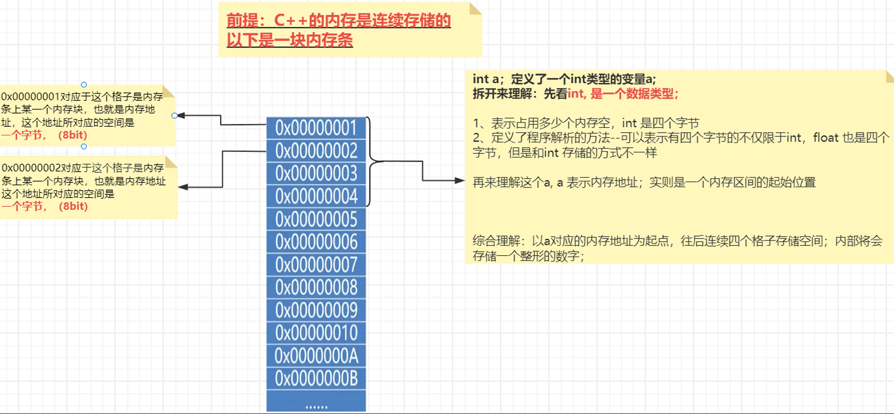

# 文件结构

**Headers**：首文件（头文件），描述一个类，一个文件元素清单；

**Sources**：源文件（主文件），主要的代码；


## #include

文件包含命令

#include 是C语言预处理命令的一种，用来引入对应的头文件

* 预处理：在编译时决定，而不是执行时

* `#include <>`: 先在系统路径中查找引入的文件，找不到再在自定义目录中查找

* `#include ""`: 先在自定义目录中查找引入的文件，找不到再到系统路径中查找

### 重复引用

有如下代码结构：

```cpp
// class1.cpp
class Clazz1 {};

// class2.cpp
#include "class1.cpp"

class Clazz2 {};

// main.cpp
#include "class1.cpp"
#include "class2.cpp"
```

在 `main.cpp` 中发生了重复引用

`main.cpp` 引用了 `class1.cpp` `class2.cpp`，`class2.cpp` 引用了 `class1.cpp`，而 `main.cpp` 又通过引用 `class2.cpp` 间接应用了 `class1.cpp` 导致了重复引用


### #ifdef-define-endif 与 #pragma once

用于防止同一个文件在编译时被重复包含和编译，引起多重定义的问题

* `ifndef`: if not defined
* `ifdef`: if defined
* `define`: 定义
* `endif`: 结束

```cpp
// class1.cpp
#ifndef _Clazz1_Public
#define _Clazz1_Public

class Clazz1 {};

#endif

// class2.cpp
#ifndef _Clazz2_Public
#define _Clazz2_Public
#include "class1.cpp"

class Clazz2 {};

#endif

// main.cpp
#include "class1.cpp"
#include "class2.cpp"
```


* `#pragma once`

```cpp
// class1.cpp
#pragma once

class Clazz1 {};

// class2.cpp
#pragma once

class Clazz2 {};

// main.cpp
#include "class1.cpp"
#include "class2.cpp"
```


# 数据类型

C++是强类型语言

数据类型决定了变量怎么在内存中存储与解析


## 内存和数据类型的关系




## 基础类型

`sizeof`: 获取类型所占字节数

`numeric_limits<TYPE>`: 通过`TYPE`泛型获取对应类型的最大最小值

```cpp
sizeof(int) // 4

numeric_limits<int>::max; // 2147483647
numeric_limits<int>::min; // -2147483648
```


### 枚举

用于声明一些固定长度的数据

**枚举默认初始值**

```cpp
enum color
{
  RED, GREEN, BLUE  
};

cout << RED << endl; // 0 输出枚举定义时的下标顺序
cout << GREEN << endl; // 1
```


**枚举手动初始化**

```cpp
enum color
{
  RED = 1, GREEN = 2, BLUE  
};

cout << RED << endl; // 1
cout << GREEN << endl; // 2
```

```cpp
// 枚举可以用于类型声明
color car = RED;

// 也可用于类型赋值与赋值后计算
int num = RED;
num++;
// 但无法单独进行计算
RED++; // 错误

// 只能使用枚举中定义的值
color car = YELLOW; // 错误  枚举没有定义YELLOW
// 自定义一个枚举变量
color color1 = color(1);

// 循环遍历枚举
for (color e : {RED, GREEN, BLUE}) 
{
    cout << e << endl;
}
```


# 函数

## 匿名函数

lambda 表达式是一种允许内联函数的特性，它可以用于不需要重用和命名的代码片段

`[capture list] (paramters) mutable -> return type {function body}`

```cpp
auto fun = []() {return 100;};
int result = fun();

auto sum = [](int i, int j) {return i + j;};
int result = sum(100, 200);
```

`[capture list]` 为需要使用到的外部变量

```cpp
int x = 10;
auto fun = [x](int y) {
    // x++; // error 无修饰的捕获参数默认为常量，无法修改
    return x + y;
};

// 使用引用
int x = 10;
auto fun = [&x](int y) {
	x = 100;
    return x + y;
};

// 自动捕获
int x = 10;
auto fun = [=](int y) {
    return x + y;
};

// 混合捕获
int x = 10;
int y = 20;
int z = 30;
auto fun = [=, y, &z](int i) {
    z = 40;
    return i+ x + y + z
};

```

`mutable` 修饰 lambda 函数中按值捕获的参数可以在函数体修改

```
int x = 10;
auto fun = [x](int y) {
    // x++; // error 无修饰的捕获参数默认为常量，无法修改还
    return x + y;
};

auto fun = [x](int y) mutable {
    x++; // 允许
    return x + y;
};
```

`noexcept` 表示 lambda 函数不会抛出异常

```cpp
auto fun = []() {
	throw(0); // 允许
};

auto fun = []() noexcept {
	throw(0); // 不允许
};
```


# 异常

`try` `catch`  `throw`

## 抛出

```cpp
throw -1; // throw 一个 int 值
throw ENUM_INVALID_INDEX; // throw 一个 枚举值
throw "Can not take square root of negative number"; // throw 一个C样式字符串 (const char*)
throw dX; // throw 一个定义的变量
throw MyException("Fatal Error"); // Throw 一个 MyException 类的对象
```


## 异常处理

```
#include <iostream>
#include <string>

int main()
{
    try
    {
        // 抛出异常
        throw -1; // 这是一个简单的例子
    }
    catch (double) // 注: 没有变量名，因为下方没有使用
    {
        // try块内的double异常会在这里处理
        std::cerr << "We caught an exception of type double\n";
    }
    catch (int x)
    {
        // try块内的int异常会在这里处理
        std::cerr << "We caught an int exception with value: " << x << '\n';
    }
    catch (const std::string&) // const引用 异常捕获
    {
        // try块内的std::string异常会在这里处理
        std::cerr << "We caught an exception of type std::string\n";
    }

    // 异常处理完后，会在这里接着执行
    std::cout << "Continuing on our merry way\n";

    return 0;
}
```

使用 `catch(,,,)` 捕获所有异常

## 常见异常

```cpp
std::exception;
std::bad_alloc:
std::bad_cast;
std::bad_exception;
std::bad_typeid;
std::logic_error:
std::domain_error;
std::invalid_argument;
std::length_error;
std::out_of_range;
std::runtime_error;
std::range_error;
std:underflow_error; 
```


## 自定义异常

```cpp
struct MyException : public exception 
{
  const char* what() const throw() {return "MyException";}
};
```


## 不抛出异常

`noexcept`

修饰函数时表示该函数不会向**调用者**抛出异常

```cpp
int add(int x, int y) noexcept 
{
    throw 1;
}

int main() 
{
    add(1, 2); // terminate
}
```


# 指针

